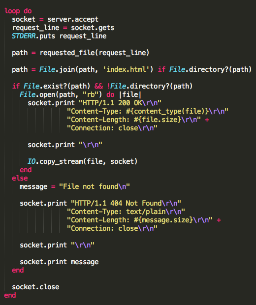

# Ruby_Server

By [Phil Worthington](https://github.com/philworthington).

## Description
This is a simple server built in Ruby to serve files from a directory over HTTP.

## Information

1) The browser issues an HTTP request by opening a TCP socket connection. The server accepts the connection.

2) The HTTP client then sends the request over the connection.

3) The server then parses the request with the HTTP method (GET), Request-URI (/file.txt), and HTTP version (1.1).

4) The server then responds with the contents of the file.

5) The server finishes the response by closing the socket.

## Contributing

1. Fork it
2. Create your feature branch (`git checkout -b my-new-feature`)
3. Commit your changes (`git commit -am 'Add some feature'`)
4. Push to the branch (`git push origin my-new-feature`)
5. Create new Pull Request

